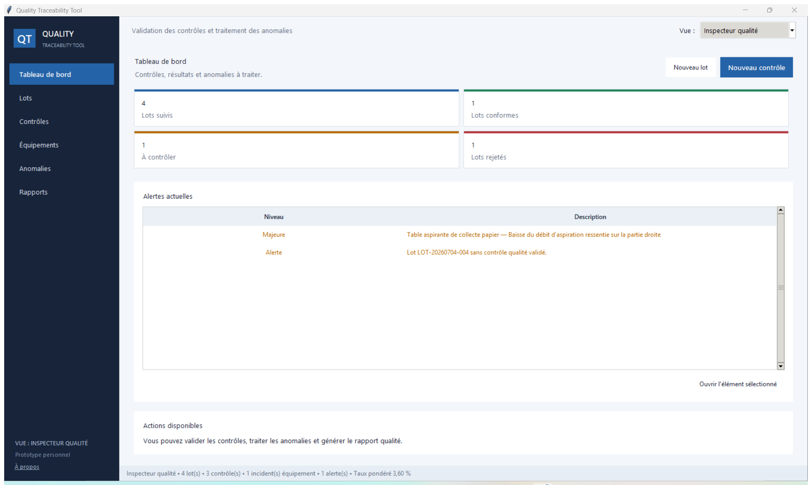

# Quality Traceability Tool

Application de bureau réalisée en Python pour suivre des lots, leurs contrôles
qualité et les incidents liés aux équipements.

> Ce projet est un prototype personnel inspiré d’un environnement de production
> électronique. Toutes les données, machines et procédures sont fictives.



## À propos du projet

L’idée de départ était simple : pouvoir retrouver l’état d’un lot, comprendre
comment cet état a été calculé et conserver les actions effectuées lorsqu’un
écart est détecté. J’ai ensuite ajouté le suivi des équipements pour relier les
problèmes qualité aux incidents et aux périodes d’utilisation.

L’application permet notamment de :

- créer, rechercher et archiver des lots ;
- enregistrer puis valider des contrôles qualité ;
- calculer les taux de défaut à partir de seuils configurables ;
- détecter et traiter les anomalies de données ;
- suivre les équipements, les incidents et les temps d’utilisation ;
- produire un rapport Markdown ou un export des données.

Trois vues sont proposées : Employé, Inspecteur qualité et Manager. Elles
adaptent les pages et les actions affichées, mais ne constituent pas un système
d’authentification.

## Installation et lancement

Le projet utilise uniquement la bibliothèque standard de Python. Il faut Python
3.8 ou une version plus récente.

```powershell
git clone https://github.com/RaphaelCordelle/quality-traceability-tool.git
cd quality-traceability-tool
py -3 main.py
```

Sous Linux ou macOS, la dernière commande peut être remplacée par
`python3 main.py`. Dans EduPython, il suffit d’ouvrir `main.py` puis de
l’exécuter.

Au premier démarrage, le jeu fictif fourni dans `samples/` est copié dans
`data/`. Les essais réalisés dans l’application ne modifient donc pas les
exemples publiés sur GitHub.

Quelques commandes sont aussi disponibles sans passer par l’interface :

```powershell
py -3 main.py console  # interface texte
py -3 main.py check    # contrôle de cohérence
py -3 main.py report   # génération d'un rapport
py -3 main.py export   # export des données
py -3 main.py restore  # restauration du jeu fictif
```

## Essai rapide

Pour découvrir les principaux parcours :

1. ouvrir un lot depuis le tableau de bord ;
2. consulter les contrôles qui déterminent son statut ;
3. créer un lot et ajouter un contrôle en attente ;
4. passer en vue Inspecteur qualité pour valider ce contrôle ;
5. ouvrir une anomalie ou signaler un incident sur un équipement ;
6. générer un rapport depuis la page **Rapports et exports**.

Un lot du jeu fictif ne possède volontairement aucun contrôle. Il sert à montrer
la détection et la résolution d’une anomalie.

## Organisation du code

```text
main.py             démarrage et commandes
models.py           structures de données
quality_rules.py    calculs et validations
storage.py          lecture et écriture des CSV et du JSON
services.py         actions métier
reporting.py        génération du rapport Markdown
console_ui.py       interface texte
gui*.py             interface Tkinter
tests/              tests automatisés
```

Une saisie suit toujours le même chemin :

```text
interface → service → validation → stockage
```

Les calculs et les écritures ne sont pas réalisés directement dans les boutons
Tkinter. Cette séparation permet de tester les règles sans ouvrir l’interface.

## Tests

```powershell
py -3 -m unittest discover -s tests -v
```

Les 52 tests couvrent les principales règles qualité, les changements d’état,
la persistance des CSV, les anomalies, les équipements et la génération des
rapports. Chaque scénario utilise un dossier temporaire afin de ne pas toucher
aux données de démonstration.

## Choix techniques et limites

Le stockage CSV est volontaire : les fichiers restent faciles à ouvrir et à
présenter. Les écritures passent par un fichier temporaire et l’ancienne version
est conservée en `.bak`.

Cette solution convient à une démonstration locale avec un seul utilisateur.
Une version destinée à plusieurs postes demanderait une base de données, de
véritables comptes, une gestion des droits et des sauvegardes centralisées.

Le détail des règles et du stockage se trouve dans les
[notes techniques](docs/technical-notes.md).
