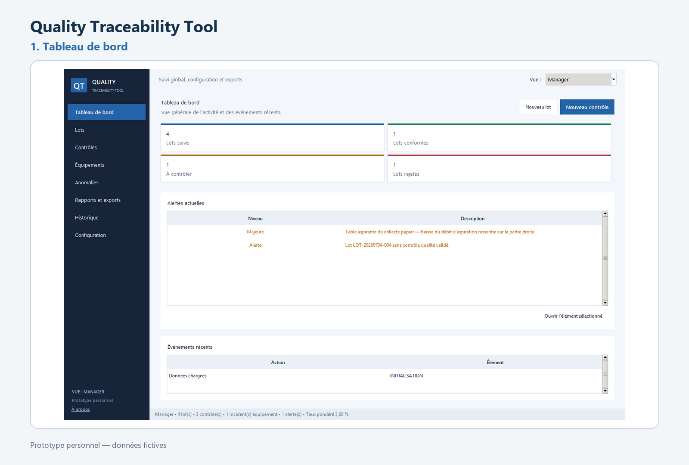
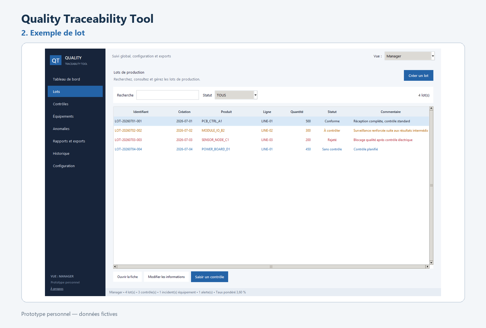
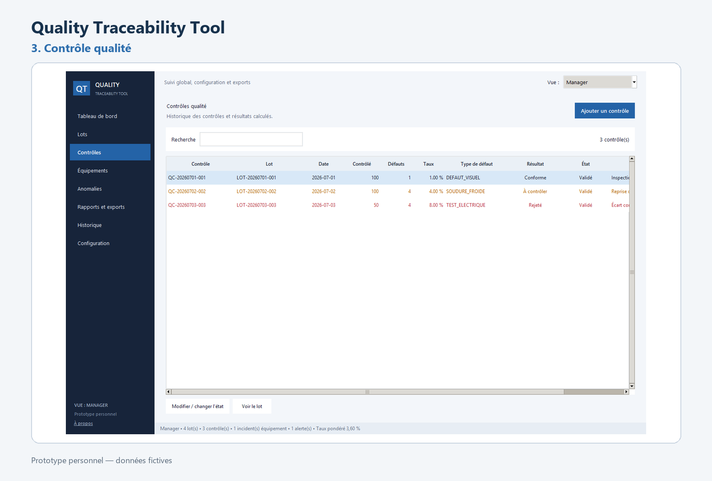
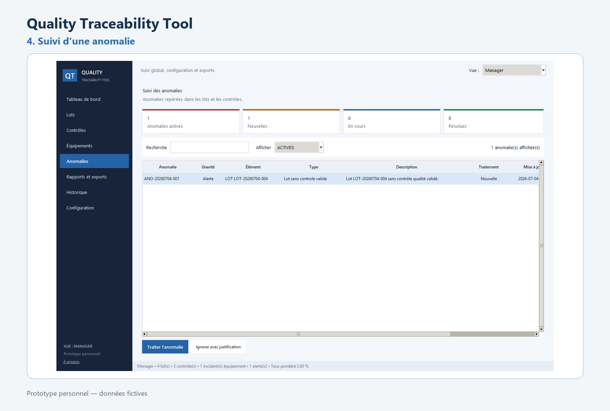

# Outil de suivi qualité et de traçabilité

Application locale en Python pour suivre des lots de production, leurs contrôles qualité et les incidents liés aux équipements. Le projet est inspiré de situations observées pendant un stage ouvrier dans l’industrie électronique ; toutes les données et procédures publiées sont fictives.



## Fonctions principales

- création, recherche et archivage des lots ;
- saisie et validation des contrôles qualité ;
- calcul des taux de défaut et mise à jour du statut des lots ;
- détection et suivi des anomalies ;
- suivi des équipements, de leur utilisation et des incidents ;
- rapports Markdown, exports et contrôle de cohérence des données.

<p align="center">
  
  
  
</p>

## Interface

L’interface Tkinter propose trois profils d’affichage : employé, inspecteur qualité et manager. Ils adaptent les pages et les actions visibles, mais ne constituent pas un système d’authentification ou de gestion des droits.

## Lancer l’application

Le projet utilise uniquement la bibliothèque standard de Python 3.8 ou version ultérieure.

```powershell
git clone https://github.com/RaphaelCordelle/quality-traceability-tool.git
cd quality-traceability-tool
py -3 main.py
```

Au premier lancement, les fichiers fictifs de [`samples/`](samples/) sont copiés dans `data/`. Les essais ne modifient donc pas les exemples versionnés.

Commandes disponibles :

```text
py -3 main.py console   interface texte
py -3 main.py check     contrôle de cohérence
py -3 main.py report    génération d’un rapport
py -3 main.py export    export des données
py -3 main.py restore   restauration des données fictives
```

## Organisation

```text
interface → services → validation → stockage local
```

La logique métier est séparée des interfaces graphique et texte. Les services appliquent les règles avant d’écrire dans les fichiers CSV ou JSON. Une sauvegarde `.bak` est conservée lors du remplacement d’un CSV. Un [exemple de rapport](reports/example_quality_report.md) est inclus.

Les règles de calcul, les changements d’état et le stockage sont décrits dans les [notes techniques](docs/technical-notes.md).

## Tests

```powershell
py -3 -m unittest discover -s tests -v
```

Les 54 tests couvrent notamment les statuts des lots, les seuils de défaut, les anomalies, les équipements, les incidents, les fichiers et la génération des rapports. Ils utilisent des dossiers temporaires et ne modifient pas les données d’exemple.

## Périmètre

Cette version fonctionne localement pour un seul utilisateur. Elle ne contient ni serveur central, ni comptes, ni accès simultanés depuis plusieurs postes.

Les fiches d’équipement affichées par l’application sont des rappels généraux associés aux données de démonstration. Elles ne remplacent pas une notice constructeur ou une procédure de sécurité. Leurs [sources publiques](docs/equipment-safety-sources.md) sont indiquées dans le dépôt.

## Auteur

Raphael Cordelle — étudiant ingénieur à l’ESIEE Paris
